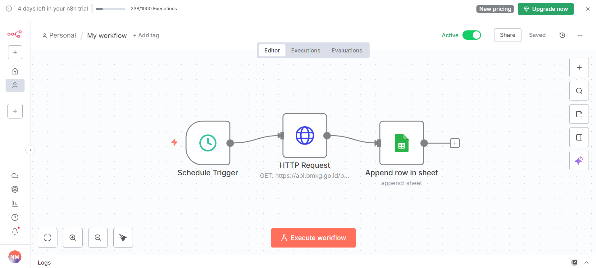

<!DOCTYPE html>
<html lang="id">
<head>
    <meta charset="UTF-8">
    <meta name="viewport" content="width=device-width, initial-scale=1.0">
    
</head>
<body>

<header>
   <h1 align="center">🌤️ UNSRAT Climate AI</h1>
<p align="center"><b>Hyper-local Campus Weather Forecasting System</b></p>
<p align="center">End-to-End Machine Learning Project | ETL – Modeling – Deployment</p>

<p align="center">
  
  
  
  
</p>

---

## 🧩 Ringkasan Proyek

UNSRAT Climate AI adalah sistem **prakiraan cuaca mikro-kampus** berbasis Machine Learning untuk area kampus UNSRAT Bahu.  
Proyek ini dirancang agar dapat:

- memprediksi suhu dan hujan hingga **6 jam ke depan**,  
- memantau kondisi secara **real-time**,  
- memberi **rekomendasi tindakan** yang mudah dipahami pengguna.

---

## 🏗 Arsitektur Sistem

Sistem terdiri dari tiga komponen utama:

1. **Automated ETL Pipeline (n8n)**  
   Mengambil data real-time dari API BMKG setiap jam dan menyimpannya ke Google Sheets.

2. **Machine Learning Engine (Python – Jupyter – XGBoost)**  
   Digunakan untuk preprocessing, EDA, feature engineering, training, dan evaluasi.

3. **Deployment Layer (Streamlit App)**  
   Menyajikan prediksi dan rekomendasi tindakan kepada pengguna.

### 📌 *Gambar Arsitektur Workflow (ETL n8n)*  


### 📌 *Gambar UI Streamlit*  


---

## 🧠 Metodologi Teknis

### 1. **Pendekatan Forecasting**
- Menggunakan **Direct Multi-Step Model**
- Model terpisah untuk T+1, T+3, T+6 jam
- Error rendah dan stabil meski horizon waktu meningkat

### 2. **Strategi Hybrid (Regresi + Klasifikasi)**
- Suhu → `XGBRegressor`
- Hujan → `XGBClassifier` dengan custom threshold (>5mm)

### 3. **Evaluasi**
Data evaluasi memakai hold-out Januari 2025 – Sekarang.

| Horizon | MAE Suhu (°C) | Akurasi Hujan | Status |
|--------|---------------|---------------|--------|
| T+1    | 0.36          | 83%           | ✔ Sangat Presisi |
| T+3    | 0.59          | 74%           | ✔ Andal |
| T+6    | 0.71          | 72%           | ✔ Cukup |

---

## 🧪 Fitur Utama

- 🔁 **ETL otomatis** via n8n  
- 📊 **Prediksi cuaca** (suhu & hujan)  
- 📱 **Dashboard interaktif Streamlit**  
- 🎯 **Rekomendasi aksi otomatis**  
- 🌙 **Mode gelap**

---

## 👤 **Kontribusi Saya (Applicant Section)**

Kontribusi saya pada proyek ini meliputi:

### 🔹 **1. ETL & Data Engineering**
- Mendesain dan membangun pipeline **n8n** untuk fetching data BMKG setiap jam  
- Membersihkan data, memperbaiki anomali, menyiapkan dataset final

### 🔹 **2. Machine Learning (End-to-End Notebook)**
Saya membuat notebook lengkap mulai dari:

- **Business Understanding**  
- **Data Understanding (EDA, analisis cuaca Manado)**  
- **Data Preparation (handling missing, feature engineering, time features)**  
- **Modeling (XGBRegressor & XGBClassifier multi-step)**  
- **Hyperparameter Tuning**  
- **Evaluasi**  
- **Export model untuk deployment**

### 🔹 **3. Deployment & UI Improvement**
- Membantu merapikan tampilan Streamlit  
- Menambah mode gelap & UX improvements  
- Membuat fitur notifikasi rekomendasi tindakan  

---

## 🔧 Instalasi & Menjalankan Proyek

```bash
git clone https://github.com/USERNAME/UNSRAT-Climate-AI.git
cd UNSRAT-Climate-AI

pip install -r requirements.txt
streamlit run app.py

## 📂 Struktur Folder
📦 ML_PROJECT
 ┣ 📂 data/
 ┣ 📂 notebooks/
 ┣ 📂 app/
 ┣ 📂 utils/
 ┣ app.py
 ┗ requirements.txt

##📜 Disclaimer Akademis
Sumber Data Latih:  Model dilatih menggunakan data historis cuaca dari Open-Meteo Historical Weather API dengan koordinat Latitude: 1.48218 dan Longitude: 124.84892 (wilayah Kota Manado). 
Rentang data historis diambil mulai 13 November 2020 sampai 7 Desember 2025.
Sistem menerima input real-time dari kampus lokasi (Bahu), sehingga tetap relevan untuk mikroklimat

Mikro-klimat Kampus:</b> Meskipun sumber data berasal dari koordinat kota Manado secara umum, sistem dirancang untuk menerima input kondisi cuaca aktual dari lingkungan Kampus UNSRAT saat inference, sehingga hasil prediksi tetap relevan dengan mikro-klimat lokal kampus.
Keterbatasan Sistem n8n: Pengambilan data cuaca real-time dilakukan menggunakan n8n Cloud Free Tier
yang memiliki batas pemakaian selama 14 hari dan batas jumlah eksekusi harian. 
Keterbatasan ini dapat memengaruhi kontinuitas otomatisasi pipeline data apabila masa percobaan telah habis.

## 📬 Kontak
Jika ingin berdiskusi atau merekrut saya, hubungi:
nataliotumuahi@gmail.com

</body>
</html>
